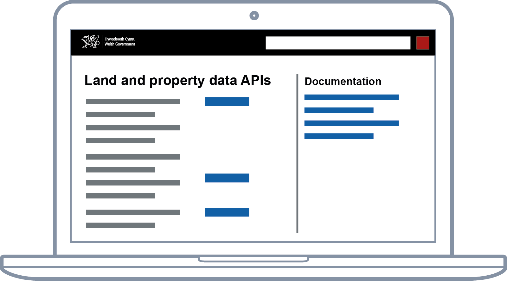

We know that, in the future, the WRA may need to support geographically varied land and property taxes, like the changes to Land Transaction Tax currently being consulted on. We also want to be able to design services that reduce [administrative burden](https://en.wikipedia.org/wiki/Once-only_principle) on the public and businesses. That means we need to be able to reliably identify land and property at a more granular level than we do currently today.

The aim of the land and property data proof of concept is to look at both of these things: how a data platform might support future services and the types of services that might be possible in the future. But what do we mean by a data platform?

## Platforms support multiple services

In short, platforms create value by making it faster and simpler to design better services and meet policy intent. Platforms also support multiple services.

While services allow residents and their representatives to achieve some sort of outcome (calculate and pay a tax bill, register a property as a holiday let, or view the tax history of a property), platforms expose the rules and data of government in a standard, machine readable, way that makes building services faster and easier.

Because platforms solve common problems once, they can also enable new types of service. For example, they can enable services that meet the ‘[once-only principle](https://en.wikipedia.org/wiki/Once-only_principle)’, were data already held by government is reused, with appropriate safeguards, to save users time. Or enable integration with specialist software, like [HMRC’s Making Tax Digital](https://www.gov.uk/guidance/find-software-thats-compatible-with-making-tax-digital-for-vat) platform does. We’ll talk more about services in future blog posts.

## Platforms meet the needs of teams designing services

A good platform is more than just a dataset. They need to be designed with the needs of teams designing services in mind. That means they are well documented, easy to find and stable. The data conforms to open standards and has clear provenance. Ideally a service team should be able to pick up and use a platform unaided.

## Getting better through use

The final characteristic of a platform is that they get better though use. Data is, essentially, maintained collaboratively as a wider public good.
